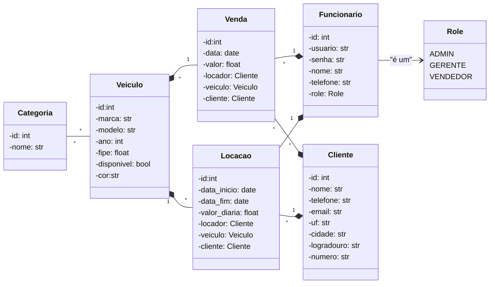

```mermaid

classDiagram
direction LR
class Funcionario {
  -id: int
  -usuario: str
  -senha: str
  -nome: str
  -telefone: str
  -role: Role

}
class Role{
    ADMIN
    GERENTE
    VENDEDOR
}
Funcionario --> Role : "é um"
class Cliente {
  -id: int
  -nome: str
  -telefone: str
  -email: str
  -uf: str
  -cidade: str
  -logradouro: str
  -numero: str

}


class Venda {
  -id:int
  -data: date
  -valor: float
  -locador: Cliente
  -veiculo: Veiculo
  -cliente: Cliente

}

class Locacao {
  -id:int
  -data_inicio: date
  -data_fim: date
  -valor_diaria: float
  -locador: Cliente
  -veiculo: Veiculo
  -cliente: Cliente

}

class Veiculo {
  -id:int
  -marca: str
  -modelo: str
  -ano: int
  -fipe: float
  -disponivel: bool
  -cor:str
}

class Categoria{
  -id: int
  -nome: str
}
Categoria "*"--"*" Veiculo
Veiculo "*"*--"1" Venda
Venda "*"--* "1" Cliente
Venda "*"--* "1" Funcionario

Veiculo "1"*--"*" Locacao
Locacao "*"--*"1" Cliente
Locacao "*"--*"1" Funcionario

```
